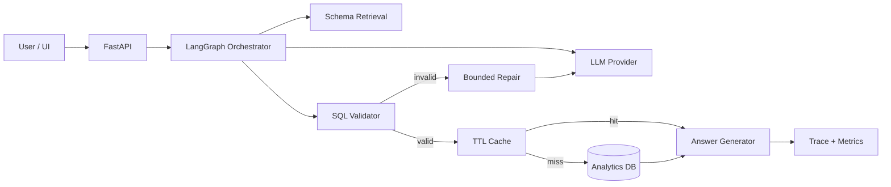

# HLD — Enterprise Analytics Copilot V0.2

## 1. Objective

Provide a production-oriented natural-language analytics workflow that converts a business question into a safe SQL query, validates it, executes it against an analytics database, and returns a concise business answer with traceable engineering metrics.

## 2. System Context

```text
+----------------------+          +----------------------+
| Streamlit UI / API  | -------> | FastAPI Query API    |
+----------------------+          +----------+-----------+
                                             |
                                             v
                                  +----------+-----------+
                                  | LangGraph Orchestrator|
                                  +----------+-----------+
                                             |
                    +------------------------+------------------------+
                    |                        |                        |
                    v                        v                        v
             Schema Retrieval          LLM Provider              Query Cache
             + Business Context       Mock/Ollama/Azure         TTL cache
                    |                        |                        |
                    +------------+-----------+                        |
                                 v                                    |
                           SQL Validator ------------------------------+
                                 |
                                 v
                           Read-only DB
                                 |
                                 v
                         Result / Answer
                                 |
                                 v
                         Trace + Metrics
```

## 3. Main Components

### API layer
- FastAPI endpoint `/api/query`
- Health endpoint `/api/health`
- Request validation and error mapping

### Orchestration layer
LangGraph coordinates:
1. schema retrieval
2. SQL generation
3. SQL validation
4. bounded repair
5. execution
6. answer generation

### Schema retrieval
V0.2 uses deterministic lexical retrieval over a business-aware schema catalog. This is intentionally model-free so retrieval behaviour is reproducible locally. A vector/hybrid catalog can be added later without changing the orchestration contract.

### LLM provider abstraction
- `mock`: deterministic local tests/demo
- `ollama`: local model execution
- `azure_openai`: optional enterprise provider

### SQL guardrail
SQLGlot parses generated SQL. Only one `SELECT` statement is accepted. Table and column names are checked against an allow-list.

### Execution layer
SQLite is the default local database. A PostgreSQL connection path is included for deployment evolution, while the sample bootstrap remains SQLite-first for reproducibility.

### Cache
A TTL cache stores successful normalized SQL results. Cache hits are reported as an observability metric.

## 4. Failure Handling

| Failure | Behaviour |
|---|---|
| Empty question | Pydantic rejects request |
| LLM unavailable | Trace records error; no unsafe execution |
| Invalid SQL | Validation blocks execution |
| Unknown table/column | Validation blocks execution |
| Multiple statements | Validation blocks execution |
| Validation failure | Up to configured repair attempts |
| DB execution error | Error returned; no fabricated answer |
| Empty result | Answer explicitly states no rows |

## 5. Security Boundary

The critical boundary is:

`LLM output -> SQL parser -> allow-list -> read-only execution`

The LLM is never trusted as a security mechanism.

## 6. Scalability Path

V0.2 is deliberately local-first. For production, the next changes are:

- PostgreSQL read replica / warehouse adapter
- Redis instead of in-process TTL cache
- asynchronous query jobs for expensive queries
- schema retrieval backed by embeddings/hybrid search
- centralized tracing and metrics
- tenant-aware authorization
- query cost controls and timeout enforcement

## 7. Key Design Trade-offs

### LangGraph vs a single function
LangGraph makes state, retries and branching explicit. This is useful when validation/repair grows into additional tools.

### Deterministic schema retrieval vs embeddings
Deterministic retrieval is easier to test and requires no model. It is sufficient for a small catalog and gives a clean migration point to hybrid retrieval.

### Mock provider
Mock mode guarantees a zero-key local demo and deterministic CI tests. It is not presented as a measure of real LLM quality.

## 8. Mermaid Component View




## V0.2.6 Intent Planning Layer

The SQL generation path now uses a hybrid strategy:

```text
User Question
      |
      v
Schema Retrieval
      |
      v
Intent Planner
   /       \
Known       Unknown
 |             |
 v             v
Deterministic  LLM SQL
SQL Plan       Generation
 \             /
  \           /
    v       v
      SQL Guard
          |
          v
       Execute
```

The planner is deliberately conservative. It only takes ownership of
high-confidence analytical intents. Unknown/ambiguous questions remain on the
LLM path.
