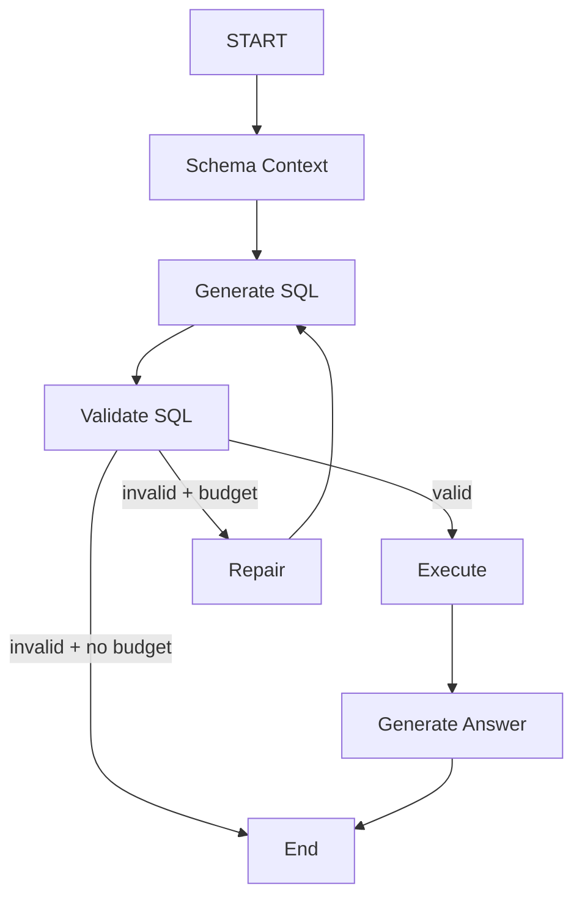

# LLD — Enterprise Analytics Copilot V0.2

## 1. Module Design

```text
app/
├── api.py                 # HTTP contract
├── agent.py               # LangGraph state machine
├── config.py              # environment configuration
├── db.py                  # DB connection/execution
├── schema.py              # API models
└── services/
    ├── cache.py           # TTL query result cache
    ├── llm.py             # provider interface + implementations
    ├── providers.py       # provider factory
    ├── schema_catalog.py  # business-aware schema retrieval
    └── sql_guard.py       # SQL parsing and policy enforcement
```

## 2. Agent State

```text
question
schema
schema_items
sql
normalized_sql
validation_valid
validation_reason
repair_attempts
columns
rows
answer
input_tokens
output_tokens
model
cache_hit
trace
error
```

## 3. Sequence

```text
Client
  |
  | POST /api/query
  v
FastAPI
  |
  v
LangGraph
  |
  +--> Schema Retrieval
  |
  +--> SQL Generation
  |
  +--> SQL Validation ---- invalid ----> Repair ----+
  |                                                  |
  |<---------------- bounded retries ----------------+
  |
  +--> Query Cache
  |       |
  |       +--> hit ------------------+
  |       |                           |
  |       +--> miss --> DB ----------+
  |
  +--> Answer Generation
  |
  v
Response + metrics + trace
```

## 4. SQL Guard Contract

Input: arbitrary generated SQL string.

Output:

```python
(valid: bool, reason: str, normalized_sql: str | None)
```

Rules:
- non-empty
- max length
- one statement
- `SELECT` only
- no mutating/administrative keywords
- valid SQLite parse tree
- known table names
- known column names

## 5. Provider Contract

```python
class LLMProvider:
    generate_sql(question, schema, repair_reason=None) -> LLMResult
    summarize(question, columns, rows) -> LLMResult
```

This allows the orchestrator to remain independent of the model vendor.

## 6. Metrics Contract

Each query reports:

- end-to-end latency
- result row count
- provider/model
- input tokens
- output tokens
- estimated cost
- cache hit
- repair attempts
- per-node trace latency

Token counts are populated when the provider returns usage metadata. Mock mode intentionally reports zero tokens.

## 7. Testing Strategy

### Unit tests
- SQL mutation rejection
- unknown column rejection
- multiple statement rejection
- schema retrieval

### API tests
- health check
- deterministic mock query

### Evaluation tests
The evaluation script checks whether expected result columns are returned for representative questions and records latency/cache metrics.

## 8. Extension Points

- `SchemaRetriever` interface for vector/hybrid retrieval
- `DatabaseAdapter` interface for warehouse-specific execution
- Redis cache implementation
- structured query plan representation
- semantic result evaluator

## 9. LangGraph State Machine


